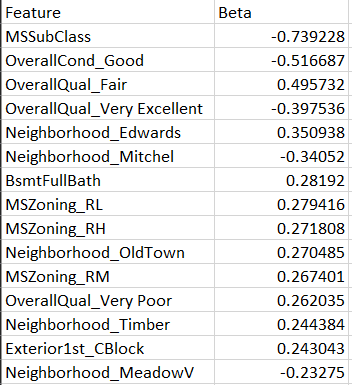

# Project Name
> Advanced Regression Assignment

## Table of Contents
* [General Info](#general-information)
* [Approach](#general-information)
* [Conclusions](#conclusions)
* [Technologies Used](#technologies-used)

## General Information
Surprise Housing is a US-based housing company has decided to enter the Australian market. The company uses data analytics to purchase houses at a price below their actual values and flip them on at a higher price

The company is looking at prospective properties to buy to enter the market.The company want a solution involving regression model using regularisation in order to predict the actual value of the prospective properties and decide whether to invest in them or not. 

Dataset containing Sales Data of House was provided, Objective is 
1. To Develop a model using regularization in order to predict SalePrice of the House
2. To find which variables are significant in predicting SalesPrice of the House
3. To Understand how exactly the prices vary with variables

So they can decide whether to invest or not into the property, Also they can accordingly manipulate the strategy of the firm and concentrate on areas that will yield high returns. Further, the model will be a good way for management to understand the pricing dynamics of a new market.

## Approach

1. [Importing Necessary Modules](#Importing-Necessary-Modules)
2. [Data Understanding](#Data-Understanding)
   - [Loading Data from the CSV](#Loading-Data-from-the-CSV)
   - [Understanding Structure of dataset](#Understanding-Structure-of-dataset)
   - [Data Quality checks](#Data-Quality-checks)
3. [Data Cleaning](#Data-Cleaning)
    - [Fixing Null Values](#Fixing-Null-Values)
    - [Fixing Data Types and Deriving new Fields](#Fixing-Data-Types-and-Deriving-new-Fields)
    - [Droping irrelevant columns](#Droping-irrelevant-columns)
4. [Data Exploration](#Data-Exploration)
5. [Data Preparion](#Data-Exploration)
    - [Creating Dummy Variables](#Creating-Dummy-Variables)
    - [Test Train Split](#Test-Train-Split)
    - [Scaling features](#Scaling-features)
    - [Test Data Prepartion](#Test-Data-Prepartion)
6. [Model Building](#Model-Building)
    - [Simple Linear Fit and Co-efficient Calculation](#Simple-Linear-Fit-and-Co-efficient-Calculation)
    - [Ridge Regression](#Ridge-Regression)
    - [Lasso Regression](#Lasso-Regression)
7. [Model Evaluation](#Model-Evaluation)
     - [Metric Comparison](#Metric-Comparison)
     - [Model co-efficients Comparison](#Model-co-efficients-Comparison)
     - [Ridge Top Predictors](#Ridge-Top-Predictors)
     - [Lasso Top Predictors](#Lasso-Top-Predictors)
     - [Lasso Traning Dataset residual Analysis](#Lasso-Traning-Dataset-residual-Analysis)
     - [Lasso Test Dataset residual Analysis](#Lasso-Test-Dataset-residual-Analysis)
8. [Conclusion](#Conclusion)

## Conclusions

Following are the predictor impacting SalePrice in order highest to lowest of absolute Co-efficient Magnitude

How well this predictors describe SalePrice is explained by it's respective co-efficient on the above Table

## Technologies Used
- numpy - version 1.5.3
- pandas - version 1.24.3
- seaborn - version 0.12.2
- matplotlib - version 3.7.1
- sklearn - version 1.2.2

## Contact
Created by [@arung12] - feel free to contact me!